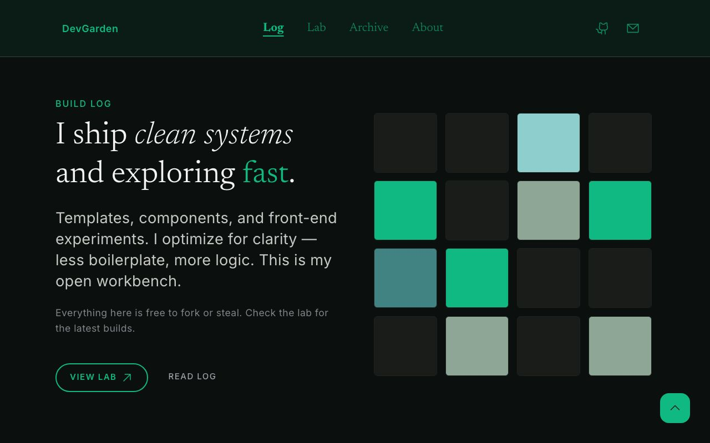

# Astro Dev Template

[](https://astro.build)
[](https://tailwindcss.com)
[](https://svelte.dev)
[](./LICENSE)

> A free, design-token-driven Astro 6 starter for dark-mode dashboards, blogs, and product showcases. Ships with **Basecoat UI**, **Svelte 5**, and **Cloudflare Pages** deploy.

**[Live Demo](https://baselayer-pk4.pages.dev/)**



---

## One-Click Deploy

Deploy your own copy in under 2 minutes:

[](https://vercel.com/new/clone?repository-url=https://github.com/baflow/baselayer)
[](https://app.netlify.com/start/deploy?repository=https://github.com/baflow/baselayer)

Or use the CLI:

```bash
# Clone
git clone https://github.com/baflow/baselayer.git my-site
cd my-site

# Install & dev
npm install
npm run dev
```

---

## Stack

| Layer | Tech |
|-------|------|
| Framework | [Astro 6](https://astro.build) (static output) |
| Styling | [Tailwind CSS v4](https://tailwindcss.com) |
| UI Kit | [Basecoat CSS](https://basecoat-css.com) |
| Components | [Svelte 5](https://svelte.dev) |
| Icons | Solar (linear) |
| Fonts | Inter + Newsreader (loaded via Astro Fonts) |
| Deployment | Cloudflare Pages (via Wrangler) |

---

## Features

- **Content Collections** with typed frontmatter for blog posts and projects
- **Design-token-driven** Tailwind theme mapped 1:1 from `DESIGN.md`
- **Basecoat UI** components (`btn`, `card`, `badge`, `tabs`, etc.) -- no React needed
- **Expressive Code** for beautiful fenced code blocks
- **RSS, Sitemap, Open Graph** out of the box
- **Cloudflare-ready** with `wrangler.toml` included

---

## Project Structure

```text
├── public/               # Static assets
├── src/
│   ├── assets/           # Images processed by Astro
│   ├── components/       # Astro + Svelte UI components
│   │   └── ui/           # Reusable Svelte components 
│   ├── content/          # Markdown/MDX collections
│   ├── layouts/          # Page layouts
│   ├── pages/            # File-based routes
│   └── styles/           # Tailwind theme + Basecoat imports
├── DESIGN.md             # Design system spec
├── astro.config.mjs
├── wrangler.toml
└── README.md
```

---

## Scripts

| Command | Action |
|---------|--------|
| `npm run dev` | Start dev server at `localhost:4321` |
| `npm run build` | Build production site to `./dist/` |
| `npm run preview` | Preview production build locally |
| `npm run deploy` | Deploy to Cloudflare Pages |

---

## Before you publish your site

1. **Set your site URL** in `astro.config.mjs`:
   ```js
   site: 'https://your-domain.com',
   ```
2. **Update placeholders** in `src/consts.ts` (title, description, contact links).
3. **Replace the footer** text in `src/components/Footer.astro`.
4. **Add your own content** to `src/content/blog/` and `src/content/projects/`.
5. **Replace screenshot** -- add `public/screenshot.jpg` and uncomment it in this README.
6. **Configure Wrangler** (optional) in `wrangler.toml` and `.env`.
7. **Update repo URL** in the deploy buttons above.


---

## Contributing

Feature requests and PRs are welcome. See [CONTRIBUTING.md](./CONTRIBUTING.md) for guidelines.

---

## License

MIT -- free for personal and commercial use.
