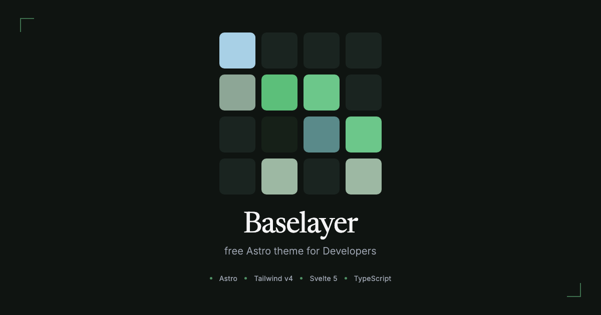

# Astro Dev Template

[](https://astro.build)
[](https://tailwindcss.com)
[](https://svelte.dev)
[](./LICENSE)

> A free, design-token-driven Astro 6 starter for dark-mode dashboards, blogs, and product showcases. Ships with **Basecoat UI**, **Svelte 5**, and **Cloudflare Pages** deploy.

**[Live Demo](https://baselayer-pk4.pages.dev/)**



---

## One-Click Deploy

Deploy your own copy in under 2 minutes:

[](https://vercel.com/new/clone?repository-url=https://github.com/baflow/baselayer)
[](https://app.netlify.com/start/deploy?repository=https://github.com/baflow/baselayer)

Or use the CLI:

```bash
# Clone
git clone https://github.com/baflow/baselayer.git my-site
cd my-site

# Install & dev
npm install
npm run dev
```

---

## Stack

| Layer | Tech |
|-------|------|
| Framework | [Astro 6](https://astro.build) (static output) |
| Styling | [Tailwind CSS v4](https://tailwindcss.com) |
| UI Kit | [Basecoat CSS](https://basecoat-css.com) |
| Components | [Svelte 5](https://svelte.dev) |
| Icons | Solar (linear) |
| Fonts | Inter + Newsreader (loaded via Astro Fonts) |
| Deployment | Cloudflare Pages (via Wrangler) |

---

## Features

- **Content Collections** with typed frontmatter for blog posts and projects
- **Design-token-driven** Tailwind theme mapped 1:1 from `DESIGN.md`
- **Basecoat UI** components (`btn`, `card`, `badge`, `tabs`, etc.) -- no React needed
- **Expressive Code** for beautiful fenced code blocks
- **RSS, Sitemap, Open Graph** out of the box
- **Cloudflare-ready** with `wrangler.toml` included

---

## Project Structure

```text
├── public/               # Static assets
├── src/
│   ├── assets/           # Images processed by Astro
│   ├── components/       # Astro + Svelte UI components
│   │   └── ui/           # Reusable Svelte components 
│   ├── content/          # Markdown/MDX collections
│   ├── layouts/          # Page layouts
│   ├── pages/            # File-based routes
│   └── styles/           # Tailwind theme + Basecoat imports
├── DESIGN.md             # Design system spec
├── astro.config.mjs
├── wrangler.toml
└── README.md
```

---

## Scripts

| Command | Action |
|---------|--------|
| `npm run dev` | Start dev server at `localhost:4321` |
| `npm run build` | Build production site to `./dist/` |
| `npm run preview` | Preview production build locally |
| `npm run deploy` | Deploy to Cloudflare Pages |

---

## Before you publish your site

1. **Set your site URL** in `astro.config.mjs`:
   ```js
   site: 'https://your-domain.com',
   ```
2. **Update placeholders** in `src/consts.ts` (title, description, contact links).
3. **Replace the footer** text in `src/components/Footer.astro`.
4. **Add your own content** to `src/content/blog/` and `src/content/projects/`.
5. **Replace thumbnail** — add `public/thumbnail.png` (1200x630 recommended).
6. **Configure Wrangler** (optional) in `wrangler.toml` and `.env`.
7. **Update repo URL** in the deploy buttons above.


---

## Cloudflare Worker (email proxy)

The `cf-worker/` folder contains a Cloudflare Worker that acts as a secure email proxy. It accepts form submissions from the static Astro site, validates them via **Turnstile**, applies **rate limiting**, and sends email through **Resend**.

### What it does

| Step | Protection |
|------|------------|
| CORS | Returns headers for `POST` and `OPTIONS` |
| Honeypot | Rejects requests with a filled `website` field |
| Turnstile | Verifies Cloudflare Turnstile anti-spam token |
| Rate limit | Configurable max emails per IP within a sliding window (set `RATE_LIMIT_MAX=0` to disable) |
| Domain lock | Forces `From:` address to end in `SENDER_DOMAIN` |
| Resend relay | Sends the email via Resend API |

### Required secrets & variables

| Name | Type | How to set | Purpose |
|------|------|------------|---------|
| `RESEND_API_KEY` | Secret | `wrangler secret put RESEND_API_KEY` | Resend API bearer token |
| `TURNSTILE_SECRET` | Secret | `wrangler secret put TURNSTILE_SECRET` | Cloudflare Turnstile site secret |
| `RATE_LIMIT_KV` | KV binding | `wrangler.toml` (`[[kv_namespaces]]`) | KV namespace for rate-limit storage |
| `SENDER_DOMAIN` | Variable | `wrangler.toml` (`[vars]`) | Allowed sender domain (e.g. `unityservice.ovh`) |
| `RATE_LIMIT_MAX` | Variable | `wrangler.toml` (`[vars]`) | Max requests per IP (default `2`, set `0` to disable) |
| `RATE_LIMIT_WINDOW_MINUTES` | Variable | `wrangler.toml` (`[vars]`) | Sliding window in minutes (default `15`) |

### Setup steps

1. **Create a KV namespace** (if you don't have one yet):
   ```bash
   npx wrangler kv:namespace create "RATE_LIMIT_KV"
   ```
   Copy the returned `id` into `cf-worker/wrangler.toml` under `[[kv_namespaces]]`.

2. **Set your domain and rate limits** in `cf-worker/wrangler.toml`:
   ```toml
   [vars]
   SENDER_DOMAIN = "yourdomain.com"
   RATE_LIMIT_MAX = "2"
   RATE_LIMIT_WINDOW_MINUTES = "15"
   ```
   > Set `RATE_LIMIT_MAX = "0"` to disable rate limiting entirely.

3. **Add secrets**:
   ```bash
   cd cf-worker
   npx wrangler secret put RESEND_API_KEY
   npx wrangler secret put TURNSTILE_SECRET
   ```

4. **Deploy the worker**:
   ```bash
   cd cf-worker
   npx wrangler deploy
   ```

5. **Wire it to your front-end** — point the contact form action to the worker URL:
   ```ts
   fetch('https://email-cloudflare-resend.<subdomain>.workers.dev/send', {
     method: 'POST',
     headers: { 'Content-Type': 'application/json' },
     body: JSON.stringify({
       to: 'hello@yourdomain.com',
       from: 'noreply@yourdomain.com',
       subject: 'New contact',
       text: '...',
       turnstileToken: turnstileResponse,
     }),
   });
   ```

### Rate-limit mechanism

Rate limiting is IP-based and implemented as a **sliding window** in Cloudflare KV. Two optional variables control its behaviour:

> **Tip:** To disable rate limiting completely, set `RATE_LIMIT_MAX = "0"` in `wrangler.toml`. The worker will skip all rate-limit checks and allow unlimited requests.

| Variable | Default | Description |
|----------|---------|-------------|
| `RATE_LIMIT_MAX` | `2` | Max requests allowed per IP within the window. Set to `0` to **disable** rate limiting entirely. |
| `RATE_LIMIT_WINDOW_MINUTES` | `15` | Length of the sliding window in minutes. |

- **Storage:** a KV key `rate_limit:<ip>` holds an array of request timestamps.

Every incoming request:
1. Reads the timestamp array for the caller's IP.
2. Drops entries older than the configured window.
3. If the cleaned array already has `RATE_LIMIT_MAX` entries, the request is **rejected** with HTTP `429 Too Many Requests`.
4. `Retry-After` header (and `retryAfterSeconds` in JSON body) tells the client how many seconds remain until the oldest timestamp ages out.
5. If under the limit, the current timestamp is appended, the array is re-sorted, and it is written back to KV with a TTL matching the window length.

Disabling rate limiting is useful during development or when the worker sits behind another gateway that already handles throttling. This is a lightweight, stateless approach that does not require an external Redis or database.

---

## Contributing

Feature requests and PRs are welcome. See [CONTRIBUTING.md](./CONTRIBUTING.md) for guidelines.

---

## License

MIT -- free for personal and commercial use.
